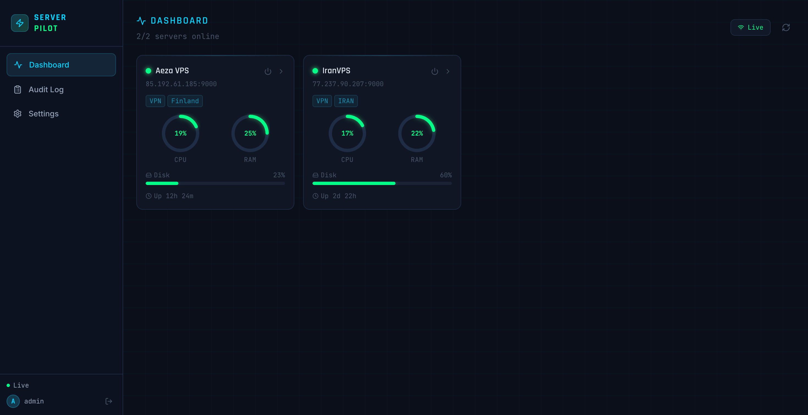
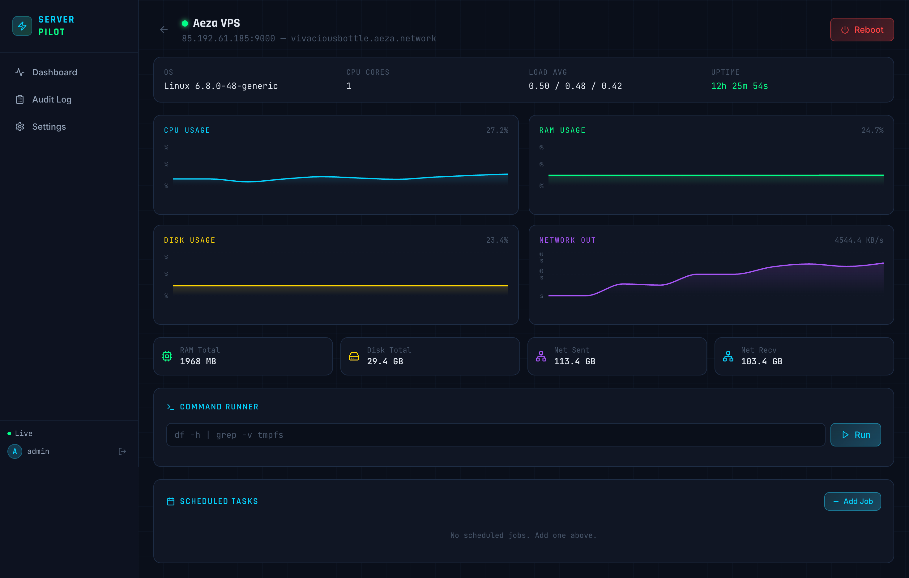
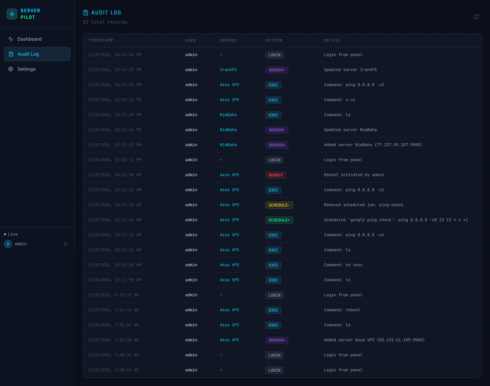

<div align="center">

```
 ███████╗███████╗██████╗ ██╗   ██╗███████╗██████╗ ██████╗ ██╗██╗      ██████╗ ████████╗
 ██╔════╝██╔════╝██╔══██╗██║   ██║██╔════╝██╔══██╗██╔══██╗██║██║     ██╔═══██╗╚══██╔══╝
 ███████╗█████╗  ██████╔╝██║   ██║█████╗  ██████╔╝██████╔╝██║██║     ██║   ██║   ██║
 ╚════██║██╔══╝  ██╔══██╗╚██╗ ██╔╝██╔══╝  ██╔══██╗██╔═══╝ ██║██║     ██║   ██║   ██║
 ███████║███████╗██║  ██║ ╚████╔╝ ███████╗██║  ██║██║     ██║███████╗╚██████╔╝   ██║
 ╚══════╝╚══════╝╚═╝  ╚═╝  ╚═══╝  ╚══════╝╚═╝  ╚═╝╚═╝     ╚═╝╚══════╝ ╚═════╝    ╚═╝
```

**Self-hosted server management panel with real-time metrics, remote command execution, and scheduled task automation.**

[](https://github.com/Amirhossein-Asadzadeh/serverpilot/actions)
[](https://python.org)
[](https://fastapi.tiangolo.com)
[](https://react.dev)
[](https://docker.com)
[](https://terraform.io)
[](LICENSE)

</div>

---

## Screenshots

| Dashboard | Server Detail | Audit Log |
|:---------:|:-------------:|:---------:|
|  |  |  |

> *Deploy the panel and add a screenshot — your future hiring manager will thank you.*

---

## Features

- 📊 **Real-time Metrics** — Live CPU, RAM, disk, and network graphs via WebSocket with 5-second updates
- 🔄 **Remote Reboot** — One-click reboot with confirmation dialog; auto-detects when server comes back online
- 💻 **Command Runner** — Execute shell commands on any VPS directly from the browser with live output
- ⏰ **Task Scheduler** — Create, list, and delete cron jobs on remote servers via APScheduler
- 🔔 **Offline Alerts** — Automatic online/offline detection with debounced failure counting
- 🔐 **JWT Auth + Audit Log** — Stateless authentication, bcrypt passwords, and an immutable action log
- 🤖 **Agent Architecture** — No SSH keys needed; lightweight Python agent installs in 60 seconds
- 🐳 **Docker Compose** — Full production stack (backend, frontend, nginx, postgres) in one command
- ☁️ **Terraform AWS** — One-command EC2 provisioning with security groups and Elastic IP
- 🔒 **Hardened Agent** — Non-root `serverpilot` user, systemd sandboxing, optional IP firewall rules

---

## Architecture

```
                   ┌──────────────────────────────────────────────┐
                   │              Browser (React 18 SPA)           │
                   │   Dashboard · Server Detail · Audit Log       │
                   └────────────────────┬─────────────────────────┘
                                        │ HTTP / WebSocket
                   ┌────────────────────▼─────────────────────────┐
                   │              Nginx  (port 80 / 443)           │
                   │   /api/*  →  FastAPI Backend                  │
                   │   /ws/*   →  WebSocket upgrade                │
                   │   /*      →  React static assets              │
                   └──────┬──────────────────────────┬────────────┘
                          │                          │
             ┌────────────▼──────────┐   ┌──────────▼──────────┐
             │   FastAPI Backend     │   │   React Frontend     │
             │   SQLAlchemy + JWT    │   │   Vite + Tailwind    │
             │   ┌───────────────┐   │   └─────────────────────┘
             │   │  SQLite /     │   │
             │   │  PostgreSQL   │   │
             │   └───────────────┘   │
             └──────────┬────────────┘
                        │  HTTP Bearer token auth
          ┌─────────────┼──────────────────┐
          │             │                  │
  ┌───────▼──────┐ ┌────▼─────────┐ ┌─────▼────────┐
  │ VPS Agent 1  │ │ VPS Agent 2  │ │ VPS Agent N  │
  │ FastAPI:9000 │ │ FastAPI:9000 │ │ FastAPI:9000 │
  │ psutil       │ │ psutil       │ │ psutil       │
  │ APScheduler  │ │ APScheduler  │ │ APScheduler  │
  │ systemd svc  │ │ systemd svc  │ │ systemd svc  │
  └──────────────┘ └─────────────┘ └──────────────┘
```

---

## Tech Stack

| Layer | Technology | Purpose |
|-------|------------|---------|
| **Frontend** | React 18, Vite, Tailwind CSS, Recharts | Dashboard SPA with real-time charts |
| **Realtime** | WebSocket (native browser + FastAPI) | Single shared broadcast loop — scales to N clients |
| **Backend** | FastAPI, SQLAlchemy (async), Pydantic | REST + WebSocket API server |
| **Auth** | JWT (HS256), bcrypt, passlib | Stateless authentication + password hashing |
| **Database** | SQLite (dev) / PostgreSQL (prod) | Persistent server registry and audit log |
| **Agent** | FastAPI, psutil, APScheduler | Lightweight VPS monitoring daemon |
| **Proxy** | Nginx | SSL termination, static files, reverse proxy |
| **Containers** | Docker, Docker Compose | Multi-service orchestration |
| **IaC** | Terraform | AWS EC2 + security group provisioning |
| **CI/CD** | GitHub Actions | Lint, build, Trivy scan, deploy |
| **Security scan** | Trivy | Container image vulnerability scanning |

---

## Quick Start

### Prerequisites

- Docker and Docker Compose v2
- Git

### 1. Clone and configure

```bash
git clone https://github.com/Amirhossein-Asadzadeh/serverpilot.git
cd serverpilot

cp .env.example .env
```

Open `.env` and set at minimum:

```bash
SECRET_KEY=<output of: python3 -c "import secrets; print(secrets.token_hex(32))">
DEFAULT_ADMIN_PASSWORD=your-strong-password
```

### 2. Start the panel

```bash
docker compose up -d
```

Open **http://localhost** and log in with `admin` / the password you set.

### 3. Install the agent on a VPS

SSH into any VPS and run:

```bash
# Basic install
curl -sSL https://raw.githubusercontent.com/Amirhossein-Asadzadeh/serverpilot/main/agent/install.sh | bash

# Recommended — restrict agent port to your panel IP only
PANEL_IP=YOUR_PANEL_IP curl -sSL https://raw.githubusercontent.com/Amirhossein-Asadzadeh/serverpilot/main/agent/install.sh | bash
```

The installer prints a summary box with the token. Copy it into **Settings → Add Server**.

---

## Agent Installation

The agent is a lightweight FastAPI service installed as a systemd unit under a dedicated non-root `serverpilot` user.

### Install

```bash
# Basic
curl -sSL https://raw.githubusercontent.com/Amirhossein-Asadzadeh/serverpilot/main/agent/install.sh | bash

# Restrict port to panel IP (recommended for production)
PANEL_IP=1.2.3.4 curl -sSL https://raw.githubusercontent.com/Amirhossein-Asadzadeh/serverpilot/main/agent/install.sh | bash

# Custom port
AGENT_PORT=8765 PANEL_IP=1.2.3.4 \
  curl -sSL https://raw.githubusercontent.com/Amirhossein-Asadzadeh/serverpilot/main/agent/install.sh | bash
```

Re-running on an already-installed agent **upgrades in-place** — the token is preserved and the service is restarted automatically.

### Upgrade

```bash
curl -sSL https://raw.githubusercontent.com/Amirhossein-Asadzadeh/serverpilot/main/agent/upgrade.sh | sudo bash
```

Downloads the latest `agent.py`, restarts the service, and **rolls back automatically** if the new version fails to start.

### Uninstall

```bash
sudo bash agent/uninstall.sh
```

Removes all files, the system user, firewall rules, and the systemd service.

### What the installer does

1. Creates a dedicated `serverpilot` system user (no login shell, no home directory)
2. Installs files to `/opt/serverpilot-agent/` with restricted permissions
3. Generates a unique 64-char hex token using `openssl rand -hex 32` on the VPS — never transmitted over the network
4. Stores the token in `/etc/serverpilot/agent.conf` (mode 640, owner `root:serverpilot`)
5. Creates a Python virtualenv and installs dependencies
6. Configures UFW or iptables with optional IP restriction (`PANEL_IP`)
7. Enables and starts `serverpilot-agent` as a systemd service
8. Waits for the HTTP server to be ready and confirms with a health check
9. Prints the full token in a summary box ready to copy into the panel

### Security model

| Feature | Detail |
|---------|--------|
| Runs as | `serverpilot` system user (non-root, no login shell) |
| Config | `/etc/serverpilot/agent.conf` — mode 640, owner `root:serverpilot` |
| systemd | `NoNewPrivileges`, `ProtectSystem=strict`, `ProtectHome`, `PrivateTmp` |
| Network | Port optionally locked to panel IP via UFW/iptables |
| Reboot | `sudo reboot` via minimal sudoers rule — only that command, nothing else |
| Commands | Shell exec runs as `serverpilot` user, not root |
| Recovery | `After=network-online.target` + `StartLimitIntervalSec=0` — always restarts after reboot |

### Agent API endpoints

| Method | Path | Auth | Description |
|--------|------|------|-------------|
| `GET` | `/health` | None | Health check (used by panel's 30s ping) |
| `GET` | `/version` | None | Agent version string |
| `GET` | `/metrics` | Bearer | Full system metrics snapshot |
| `POST` | `/reboot` | Bearer | Schedule reboot (2s delay, via sudo) |
| `POST` | `/exec` | Bearer | Execute shell command |
| `POST` | `/schedule` | Bearer | Add a cron job |
| `DELETE` | `/schedule/{id}` | Bearer | Remove a cron job |
| `GET` | `/schedule` | Bearer | List scheduled jobs |

---

## Environment Variables

### Backend (`.env`)

| Variable | Default | Description |
|----------|---------|-------------|
| `DATABASE_URL` | `sqlite:///./serverpilot.db` | Database connection string |
| `SECRET_KEY` | **required** | JWT signing key — generate with `secrets.token_hex(32)` |
| `ALGORITHM` | `HS256` | JWT signing algorithm |
| `ACCESS_TOKEN_EXPIRE_MINUTES` | `480` | Token lifetime (8 hours) |
| `CORS_ORIGINS` | `http://localhost:3000` | Allowed origins (comma-separated) |
| `HEALTH_CHECK_INTERVAL` | `30` | Agent ping interval in seconds |
| `DEFAULT_ADMIN_USERNAME` | `admin` | Initial admin username |
| `DEFAULT_ADMIN_PASSWORD` | `changeme` | Initial admin password — **change this!** |
| `POSTGRES_DB` | `serverpilot` | PostgreSQL database name (prod) |
| `POSTGRES_USER` | `serverpilot` | PostgreSQL user (prod) |
| `POSTGRES_PASSWORD` | **required** | PostgreSQL password (prod) |
| `SSL_CERT_PATH` | — | Path to TLS certificate (prod nginx) |
| `SSL_KEY_PATH` | — | Path to TLS private key (prod nginx) |
| `DOMAIN` | — | Domain name for nginx SSL config |

### Frontend (build-time)

| Variable | Default | Description |
|----------|---------|-------------|
| `VITE_API_URL` | `/api` | Backend API base URL |
| `VITE_WS_URL` | auto | WebSocket URL (auto-detected from `window.location`) |

---

## CI/CD & Security

The GitHub Actions pipeline (`.github/workflows/ci-cd.yml`) runs on every push:

1. **Lint** — Ruff (Python) + ESLint (JS)
2. **Build** — Docker images for backend and frontend
3. **Scan** — [Trivy](https://trivy.dev) container vulnerability scan (fails on CRITICAL)
4. **Deploy** — SSH deploy to production on `main` branch merges

Security highlights:
- All agent tokens are generated **on the VPS** using `openssl rand -hex 32` — they never leave the server unencrypted
- Panel ↔ agent communication uses per-server Bearer tokens (not a shared secret)
- Passwords hashed with bcrypt; JWT secrets never logged or exposed in API responses
- Agent runs in a systemd sandbox with minimal filesystem write access

---

## Production Deployment

### Option A: Docker Compose (any Linux VPS)

```bash
# Generate secrets
SECRET=$(python3 -c "import secrets; print(secrets.token_hex(32))")
PGPASS=$(python3 -c "import secrets; print(secrets.token_hex(16))")

cat > .env <<EOF
SECRET_KEY=$SECRET
POSTGRES_PASSWORD=$PGPASS
DEFAULT_ADMIN_PASSWORD=your-strong-password
DATABASE_URL=postgresql://serverpilot:$PGPASS@db:5432/serverpilot
CORS_ORIGINS=https://your-domain.com
DOMAIN=your-domain.com
EOF

docker compose -f docker-compose.prod.yml up -d
```

### Option B: Terraform (AWS EC2)

```bash
cd terraform
terraform init
terraform apply \
  -var="key_pair_name=my-aws-key" \
  -var="secret_key=$(python3 -c "import secrets; print(secrets.token_hex(32))")" \
  -var="admin_password=your-strong-password"

terraform output panel_public_ip
```

---

## Local Development

### Backend

```bash
cd backend
python -m venv venv && source venv/bin/activate
pip install -r requirements.txt
uvicorn main:app --reload --port 8000
# API docs → http://localhost:8000/docs
```

### Frontend

```bash
cd frontend
npm install
npm run dev
# Dashboard → http://localhost:3000
```

---

## Roadmap

- [x] Real-time metrics dashboard (CPU, RAM, disk, network)
- [x] Remote reboot with confirmation and recovery detection
- [x] Web-based command execution with live output
- [x] Cron-based task scheduler
- [x] Audit logging with pagination
- [x] Secure one-liner agent installer (non-root, systemd hardening)
- [x] Docker Compose + Terraform deployment
- [x] GitHub Actions CI/CD with Trivy scanning
- [ ] HTTPS + Let's Encrypt auto-provisioning
- [ ] Email / Telegram offline alerts
- [ ] Docker container manager (list, start, stop, logs)
- [ ] Mobile-responsive UI / PWA
- [ ] Multi-user support with role-based access control

---

## License

MIT — see [LICENSE](LICENSE)

---

<div align="center">

Built with FastAPI · React · Docker · ❤️

</div>
